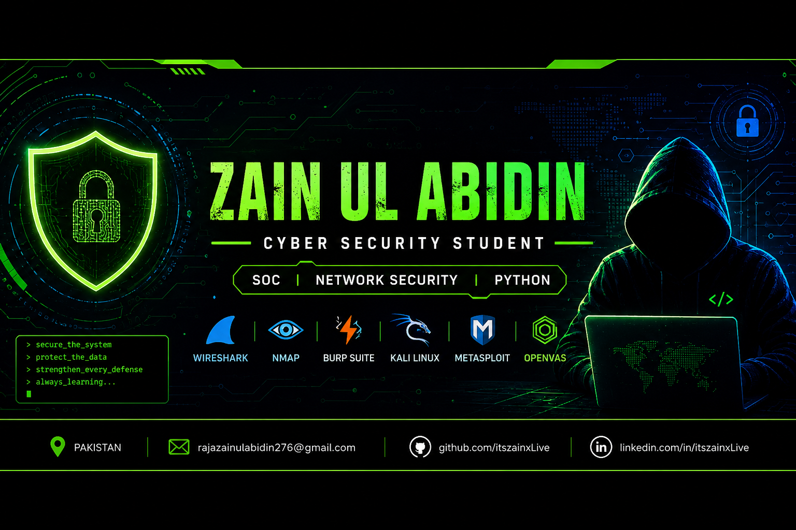
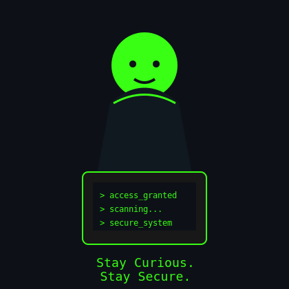

# Hi there, I'm Zain 👋

### Cyber Security Student • SOC Enthusiast • Network Security • Python Developer

<table>
<tr>

<td width="60%">

# 👋 About Me

Cyber Security undergraduate passionate about building practical security solutions.

- 🔐 SOC Operations & Blue Teaming
- 🌐 Network Security
- 🐍 Python Automation
- 🛡 Vulnerability Assessment
- 📡 Packet Analysis
- 🎯 Threat Detection
- 💻 Linux & Kali Linux

### Current Focus

- Web Application Security
- Malware Analysis
- Reverse Engineering
- Security Automation

</td>

<td width="40%">

<td width="40%" align="center">

</td>

